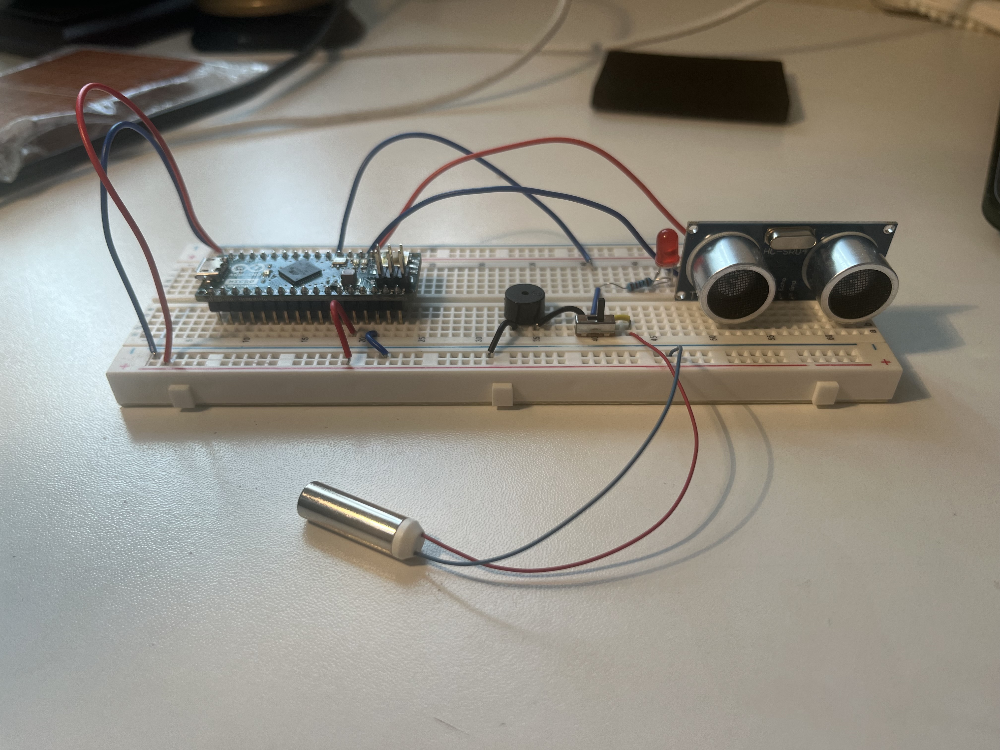
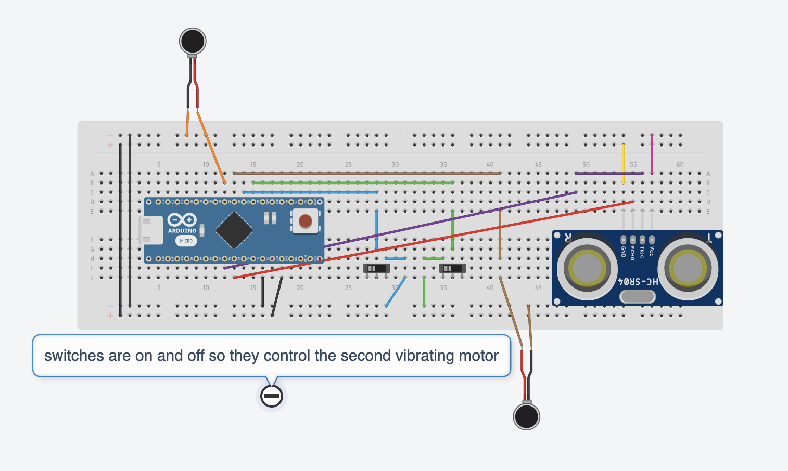

# Third Eye For The Blind
I have developed a device with the potential to assist individuals who are visually impaired. This wearable technology enables blind individuals to navigate more easily by detecting obstacles in close proximity using ultrasonic waves. The device notifies the user through escalating buzzer sounds and vibrations from a motor, intensifying as the user approaches the detected object, while also having a sensor to identify whether the object in front is a person or not.

| **Engineer** | **School** | **Area of Interest** | **Grade** |
|:--:|:--:|:--:|:--:|
| Saanya B. | James Logan High School | Bio Engineering | Incoming Sophomore


  
# Final Milestone

I have ultimately accomplished my final milestone by inserting the device onto the hat and soldered the wires and the arduino onto the perfboard to make it wearable and moveable. This was the final development of my project and I am nowfinished with the project. With this new functionality, the device is now transportable and is a functional, hands-free device that can assist the visually impaired. The process of soldering turned out to. be suprisingly difficult and I spent at least 3 hours working on soldering all the wires and making sure they were all located in the right place. However, I pushed through and finsihed up the final touches to the project. To improve the overall organization of the project, I taped the wires that connect to the same port together to help organize everything and keep it neat. This action led to a cleaner and more effective arrangement. Moving forward, I hope to receive a proper people sensor and I can continue to build on this porject after finishing this program. Overall, this program was a really great introduction to mechanical and bio engineering for me and I hope that moving forward, I will be able to expand on this project I have built and continue to develop devices to help more people.

<iframe width="560" height="315" src="https://www.youtube.com/embed/iiTIupxbPuM" title="YouTube video player" frameborder="0" allow="accelerometer; autoplay; clipboard-write; encrypted-media; gyroscope; picture-in-picture; web-share" allowfullscreen></iframe>


# Second Milestone

I successfully achieved my second milestone by adding another vibrating motor that runs two different programs based on whether someone is facing the person or not. This development was necessary because the original person sensor I received turned out to be faulty. However, I adapted to this issue and found a solution that still allows me to demonstrate what I intended to do. With this new functionality, they can now gain a comprehensive understanding of the objects in their path. The process of wiring the additional vibrating motor proved to be unexpectedly challenging, requiring considerable troubleshooting efforts to ensure precise connections. However, I persevered and overcame the obstacles I faced during my initial milestone, which included a malfunctioning LED and numerous code errors. By resolving these issues, I have achieved a fully functional system.
To improve the overall organization of the project, I have implemented a color-coded wiring system that makes it easier to understand and maintain. This step has resulted in a neater and more efficient setup. Looking ahead, my objective is to transfer the project onto a perfboard and solder the components to reach its final completion. This step will ensure a more permanent and robust construction, bringing the project closer to its ultimate goal of assisting visually impaired individuals in navigating their surroundings effectively.

<iframe width="560" height="315" src="https://www.youtube.com/embed/pZ51YU7iu60" title="YouTube video player" frameborder="0" allow="accelerometer; autoplay; clipboard-write; encrypted-media; gyroscope; picture-in-picture; web-share" allowfullscreen></iframe>

# First Milestone


My first milestone was attained by successfully setting up and connecting the ultrasonic sensor and Arduino Micro to the breadboard. This setup allowed me to test the functionality of the LED, vibrating motor, and buzzer, as well as determine the necessary wiring connections. By utilizing jumper cables, I established a connection between the Arduino and the ultrasonic sensor. I included a switch that toggles between the buzzer and vibrating motor aspects of the programmed projection. Subsequently, I developed a code that displays the distance of an object in centimeters on the serial monitor using the ultrasonic sensor. As the object approaches the sensor, the distance reading decreases, while it increases as the object moves farther away. This functionality relies on the sensor emitting sound waves that travel towards the object, then bounce back to the sensor, which in turn receives an echo. By analyzing the time it takes for the pulse to return, the sensor can accurately calculate the distance between itself and the object. I was waiting on a few parts to get delivered so the wiring was originally a bit rushed, but I am now confident it will work.

<iframe width="560" height="315" src="https://www.youtube.com/embed/Kgv0trJzpp0" title="YouTube video player" frameborder="0" allow="accelerometer; autoplay; clipboard-write; encrypted-media; gyroscope; picture-in-picture; web-share" allowfullscreen></iframe>


# Schematics 

Sketch by Author Through Tinkercad

# Bill of Materials

| **Part** | **Note** | **Price** | **Link** |
| :--- | :---: | :--: | ---: |
| Arduino Micro | Main Program Board | $10.95 | <a href="https://www.amazon.com/SparkFun-Arduino-Mini-328-3-3V-8MHz/dp/B004RF9LB8/ref=sr_1_5?crid=276NUJP5GVPNS&keywords=SparkFun+Arduino+Pro+Mini+328+-+5V%2F16MHz&qid=1686772444&sprefix=%2Caps%2C470&sr=8-5"> Link </a> |
| :--- | :---: | :--: | ---: |
| Buzzer | Used to Switch Detection from Light to Sound | $6.88 | <a href= "https://www.amazon.com/Gikfun-Active-Magnetic-Continous-Arduino/dp/B01FVZQ6F6/ref=sr_1_2_sspa?crid=31I3JQE4NAJ8J&keywords=buzzer+arduino&qid=1686772919&sprefix=buzzer%2Caps%2C191&sr=8-2-spons&sp_csd=d2lkZ2V0TmFtZT1zcF9hdGY&psc=1"> Link </a> |
| Cable Kit | Connects Person Sensor to Arduino | $9.99 | <a href= "https://www.amazon.com/elechawk-SparkFun-Development-Breadboard-Connector/dp/B08HQ1VSVL/ref=sr_1_1_sspa?crid=2AR9P95DHHEWH&keywords=SparkFun+Qwiic+Cable+Kit&qid=1687374396&sprefix=%2Caps%2C605&sr=8-1-spons&sp_csd=d2lkZ2V0TmFtZT1zcF9hdGY&psc=1"> Link </a> |
| :--- | :---: | :--: | ---: |
| Female Headers | Used to Connect Arduino and Sensor to Breadboard| $5.99 | <a href="https://www.amazon.com/HiLetgo-Single-Female-2-54mm-Vertical/dp/B00VVI1L1W/"> Link </a> |
| :--- | :---: | :--: | ---: |
| Hot Glue Gun & Hot Glue Sticks | Used to Attach Things Together | $27.49 | <a href= "https://www.amazon.com/Gorilla-8401509-Hot-Glue-Sticks/dp/B088HF5ZQ1/"> Link </a> |
| :--- | :---: | :--: | ---: |
| Jumper Wires | Used to Connect Components on the Breadboard | $9.99 | <a href= "https://www.amazon.com/MCIGICM-Breadboard-Jumper-Cables-Arduino/dp/B081GMJVPB/ref=sxin_17_pa_sp_search_thematic_sspa?content-id=amzn1.sym.6fd80408-71b6-44da-b059-082bba9089d3%3Aamzn1.sym.6fd80408-71b6-44da-b059-082bba9089d3&crid=3DIRCBWGHOZ6B&cv_ct_cx=jumper+wires&keywords=jumper+wires&pd_rd_i=B081GMJVPB&pd_rd_r=8948dacb-9531-4931-a76b-50be9ca669e2&pd_rd_w=hx8N0&pd_rd_wg=Vfast&pf_rd_p=6fd80408-71b6-44da-b059-082bba9089d3&pf_rd_r=XYNWGFWF0D205PQRWAMW&qid=1686859569&sprefix=jumper+wire%2Caps%2C185&sr=1-2-364cf978-ce2a-480a-9bb0-bdb96faa0f61-spons&sp_csd=d2lkZ2V0TmFtZT1zcF9zZWFyY2hfdGhlbWF0aWM&psc=1"> Link </a> |
| :--- | :---: | :--: | ---: |
| Male Headers | Used to Connect Arduino and Sensor to Breadboard | $10.99 | <a href= "https://www.amazon.com/ZYAMY-2-54mm-Breakable-Straight-Connector/dp/B0778KCHHR/"> Link </a> |
| :--- | :---: | :--: | ---: |
| Power Bank | Used to Provide Power to Arduino | $17.99 | <a href= "https://www.amazon.com/Anker-PowerCore-Ultra-Compact-High-Speed-Technology/dp/B01CU1EC6Y/"> Link </a> |
| :--- | :---: | :--: | ---: |
| Perfboard | Project Assembled on Top of it | $9.99 | <a href="https://www.amazon.com/ELEGOO-Prototype-Soldering-Compatible-Arduino/dp/B072Z7Y19F/"> Link </a> |
| Person Sensor | Senses Whether the Object is A Person or Not | $9.95 | <a href= "https://www.sparkfun.com/products/21231"> Link </a> |
| :--- | :---: | :--: | ---: |
| :--- | :---: | :--: | ---: |
| Ultrasonic Sensor | Main Sensor for Detection | $6.99 | <a href="https://www.amazon.com/WWZMDiB-HC-SR04-Ultrasonic-Distance-Measuring/dp/B0B1MJJLJP/ref=sr_1_3 crid=SMA11V06DTND&keywords=ultrasonic+sensor&qid=1686772587&sprefix=ultrasonic+senosr%2Caps%2C144&sr=8-3)"> Link </a> |
| :--- | :---: | :--: | ---: |
| Solderless Breadboard | Used to Build Project On | $9.99 | <a href= "https://www.amazon.com/Breadboards-Solderless-Breadboard-Distribution Connecting/dp/B07DL13RZH/ref=sr_1_1_sspa?crid=2G0A3O6U8I453&keywords=solderless+breadboard&qid=1686772774&sprefix=solderles%2Caps%2C155&sr=8-1-spons&sp_csd=d2lkZ2V0TmFtZT1zcF9hdGY&psc=1"> Link </a> |
| :--- | :---: | :--: | ---: |
| Slide Switch | Used to Toggle Between Haptic Sensor and Buzzer| $5.39 | <a href="https://www.amazon.com/HiLetgo-SS-12D00-Toggle-Switch-Vertical/dp/B07RTJDW27/"> Link </a> |
| :--- | :---: | :--: | ---: |
| Soldering Iron | Used to Solder Everything to the Breadboard | $16.99 | <a href= "https://www.amazon.com/Soldering-Kit-Temperature-Desoldering-Electronics/dp/B07GTGGLXN/"> Link </a> |
| :--- | :---: | :--: | ---: |
| Vibrating Motor | Used to Give Physical Alert of Objects | $17.99 | <a href= "https://www.amazon.com/BestTong-Miniature-Vibrating-Vibration-Coreless/dp/B073NGPHDR/ref=sr_1_9?crid=3MKLV0J4PWN9X&keywords=vibrating+motor&qid=1686859468&sprefix=vibrating+moto%2Caps%2C200&sr=8-9"> Link </a> |
| :--- | :---: | :--: | ---: |
| 5mm Red LED | Used for Output of Program | $5.99 | <a href="https://www.amazon.com/Diffused-Lighting-Electronics-Components-Emitting/dp/B01C3ZZT0A/"> Link </a> |
| :--- | :---: | :--: | ---: |


# Other Resources/Examples
- [Example Code for the Person Sensor](https://github.com/usefulsensors/person_sensor_arduino/blob/main/person_sensor_arduino.ino)
- [General Project Guide](https://www.hackster.io/muhammedazhar/third-eye-for-the-blind-8c246d)

 
# Code

```c++
    const int pingTrigPin = 23; // Trigger connected to PIN 3
    const int pingEchoPin = 22; // Echo connected to PIN 2
    const int buz = 4;
    const int motor = 5; //second vibration motor connected to PIN 5
    const int32_t SAMPLE_DELAY_MS = 200; // Represents the delay between sensor readings
    const int switch1 = 2;
    const int switch2 = 3;

    void setup() {
      Serial.begin(9600);
      pinMode(pingTrigPin, OUTPUT);
      pinMode(pingEchoPin, INPUT);
      pinMode(buz, OUTPUT);
      pinMode(switch1, INPUT_PULLUP);
      pinMode(switch2, INPUT_PULLUP);
      pinMode(motor, OUTPUT);
    }

    void loop() {
      long duration, cm;

      digitalWrite(pingTrigPin, LOW);
      delayMicroseconds(2);
      digitalWrite(pingTrigPin, HIGH);
      delayMicroseconds(5);
      digitalWrite(pingTrigPin, LOW); 

      duration = pulseIn(pingEchoPin, HIGH);
      cm = microsecondsToCentimeters(duration);
      if(cm<=50 && cm>0) {
        int d= map(cm, 1, 100, 20, 2000);
        digitalWrite(buz, HIGH);
        delay(100);
        digitalWrite(buz, LOW);
        delay(d);
      }
  
      Serial.print(cm);
      Serial.print("cm");
      Serial.println("********");
      delay(100);

    
      if (digitalRead(switch1) == 0) {   //if person found, then special vibration pattern with second motor
        digitalWrite(motor, HIGH);
        delay(500);
        digitalWrite(motor, LOW);
        delay(100);
        digitalWrite(motor, HIGH);
        delay(500);
        digitalWrite(motor, LOW);
        delay(100);
        digitalWrite(motor, HIGH);
        delay(500);
        digitalWrite(motor, LOW);
        delay(100);
      } else if (digitalRead(switch2) == 0) {
          digitalWrite(motor, HIGH);
          delay(100);
          digitalWrite(motor, LOW);
          delay(500); }
          else {
            digitalWrite(motor, LOW);
          }
  
      delay(SAMPLE_DELAY_MS);
      }

    long microsecondsToCentimeters(long microseconds) {
      return microseconds / 29 / 2;
 }
```
